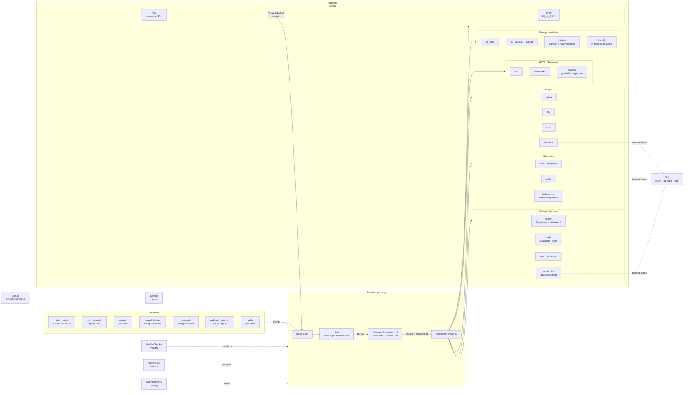
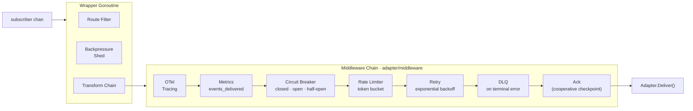
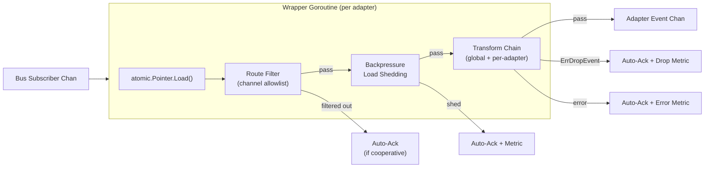
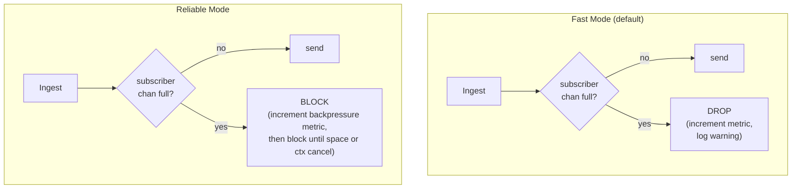
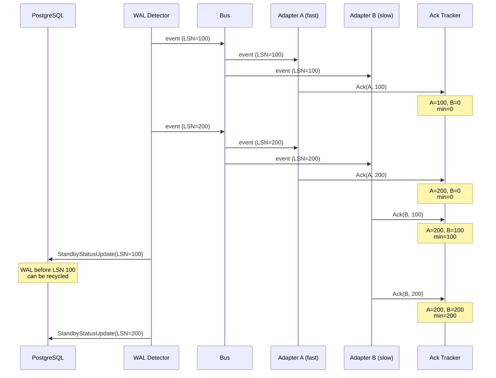
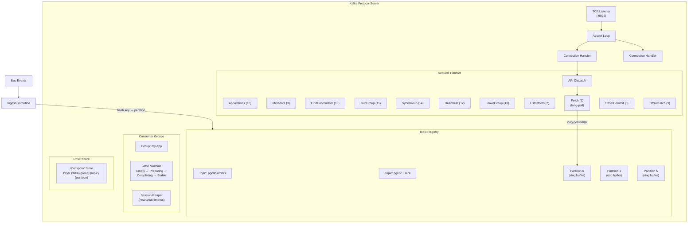
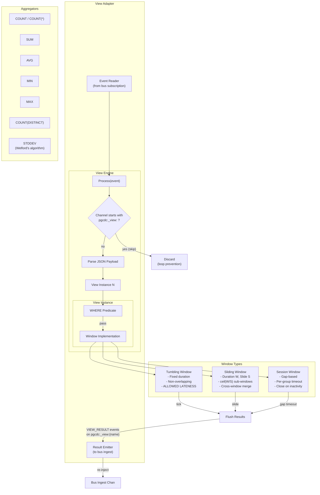
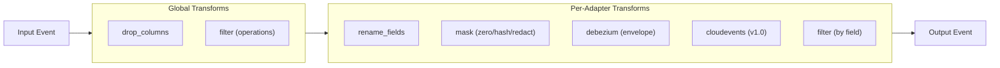
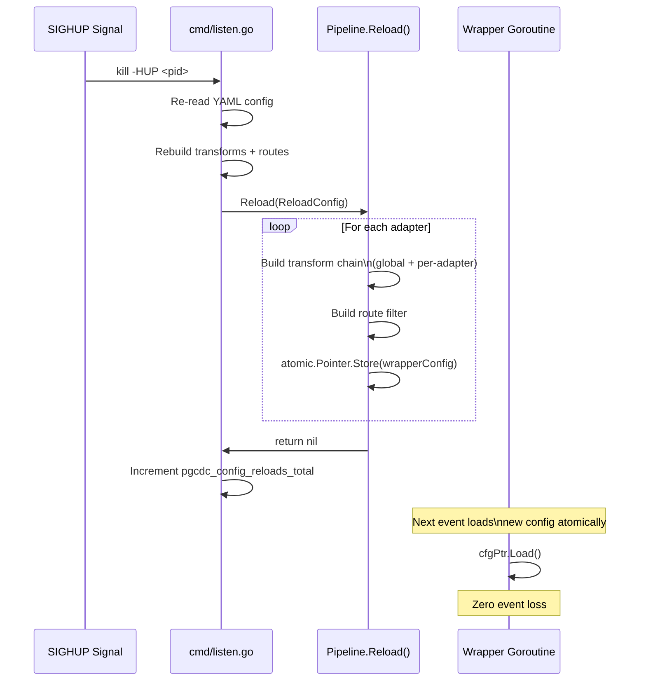

# Architecture

This document describes the internal architecture of pgcdc using Mermaid diagrams.

## Pipeline Data Flow

The core pipeline connects a detector to adapters through a fan-out bus. The `Pipeline` type in `pgcdc.go` orchestrates this:



## Middleware Chain (Deliverer Adapters)

Adapters implementing `Deliver(ctx, event) error` get a middleware chain wired automatically by `adapter/middleware`. The chain wraps the adapter before it's handed to the wrapper goroutine:



Adapters that implement `adapter.Adapter` directly (not `Deliverer`) skip the middleware chain and consume their subscriber channel in `Start()`.

## Wrapper Goroutine

Each adapter gets a dedicated wrapper goroutine that sits between the bus subscription and the adapter's event channel. The wrapper applies route filtering and transform chains, loading configuration atomically from `sync/atomic.Pointer[wrapperConfig]` for lock-free hot-reload.



## Bus Modes

The bus (`bus/bus.go`) supports two fan-out modes:



**Fast mode** (`--bus-mode fast`): Non-blocking sends. If a subscriber channel is full, the event is dropped for that subscriber. This protects the detector from being stalled by slow adapters.

**Reliable mode** (`--bus-mode reliable`): Blocking sends. The bus blocks on full subscriber channels, which back-pressures all the way to the detector. No event loss at the cost of throughput.

## Cooperative Checkpoint Flow

When `--cooperative-checkpoint` is enabled, the WAL detector only reports LSN positions that all adapters have confirmed:



The `ack.Tracker` (`ack/tracker.go`) maintains a map of adapter name to highest acked LSN. `MinAckedLSN()` returns the minimum across all registered adapters. Non-Acknowledger adapters are auto-acked on channel send.

## Backpressure Zones

The backpressure controller (`backpressure/backpressure.go`) monitors WAL lag and transitions between three zones:

```mermaid
stateDiagram-v2
    [*] --> Green

    Green --> Yellow: lag >= warn_threshold
    Yellow --> Green: lag < warn_threshold
    Yellow --> Red: lag >= critical_threshold
    Red --> Green: lag < warn_threshold (hysteresis)

    state Green {
        note right of Green
            Full speed
            Throttle: 0
            Shed: none
        end note
    }

    state Yellow {
        note right of Yellow
            Throttle: proportional to lag position
            Shed: best-effort adapters
            Detector: throttled sleep between events
        end note
    }

    state Red {
        note right of Red
            Throttle: max
            Shed: normal + best-effort adapters
            Detector: PAUSED (WaitResume blocks)
        end note
    }
```

**Hysteresis**: Red exits only when lag drops below `warn_threshold` (not `critical_threshold`), preventing rapid oscillation.

**Proportional throttle**: In the yellow zone, the throttle duration scales linearly from 0 to `max_throttle` (default 500ms) based on the lag's position within the yellow band:

```
throttle = max_throttle * (lag - warn) / (critical - warn)
```

**Load shedding**: Adapters are assigned priorities (`critical`, `normal`, `best-effort`). In yellow zone, best-effort adapters are shed (events auto-acked without delivery). In red zone, both normal and best-effort are shed. Critical adapters are never shed.

## Kafka Wire Protocol Server

The kafkaserver adapter (`adapter/kafkaserver/`) implements a TCP server speaking the Kafka wire protocol:



**Wire format**: Requests are length-prefixed (4-byte big-endian int32). The header contains API key, version, correlation ID, and client ID. ApiVersions v3+ uses flexible encoding (compact arrays, unsigned varint lengths, tagged fields).

**Partition hashing**: Events are hashed using FNV-1a on the key column (default `id`) extracted from the JSON payload, then mapped to a partition index via modulo.

**Long-poll Fetch**: When a partition has no new data, the Fetch handler registers a waiter channel on the partition. The waiter is woken when new records are appended, or when a timeout expires.

## Streaming SQL View Engine

The view engine (`view/`) processes CDC events through SQL-defined windows:



**SQL parsing**: Queries are parsed with the TiDB SQL parser after extracting custom window clauses (`TUMBLING WINDOW`, `SLIDING WINDOW ... SLIDE`, `SESSION WINDOW`) via regex. The parser validates SELECT fields, FROM (must be `pgcdc_events`), GROUP BY, and HAVING.

**Emit modes**: `row` emits one event per group key; `batch` emits a single event containing all group results as an array.

## Transform Pipeline

Transforms are applied in the wrapper goroutine, loaded atomically from `wrapperConfig`:



Transforms are composed left-to-right via `transform.Chain`. Any transform returning `transform.ErrDropEvent` silently drops the event. Other errors cause the event to be skipped with an error metric.

## SIGHUP Hot-Reload

On `SIGHUP`, the CLI handler re-reads the YAML config file and calls `Pipeline.Reload()`:



Immutable on reload: CLI flags, plugin transforms, adapters, detectors, bus mode.
Mutable on reload: `transforms:` and `routes:` YAML sections.

## Ecosystem & Edge Components

The five newer components that extend pgcdc beyond the core pipeline:

```mermaid
flowchart TB
    subgraph WGW ["detector/webhookgw · Webhook Gateway"]
        direction LR
        HTTP_IN["POST /ingest/:source"] --> SigV["Signature Validation\nStripe · GitHub · generic HMAC"]
        SigV --> WGW_OUT["event.Event\nsource=webhook_gateway"]
    end

    subgraph SQ ["detector/sqlite · SQLite CDC"]
        direction LR
        POLL["Poll loop\n100ms default"] --> SQTBL["SELECT FROM pgcdc_changes\nWHERE processed=0"]
        SQTBL --> SQ_OUT["event.Event\nsource=sqlite"]
        SQ_OUT --> SQACT{"keepProcessed?"}
        SQACT -->|"false"| DEL["DELETE row"]
        SQACT -->|"true"| MARK["UPDATE processed=1"]
    end

    subgraph GQL ["adapter/graphql · GraphQL Subscriptions"]
        direction LR
        WS_UP["WebSocket Upgrade\ngraphql-transport-ws"] --> PROTO["Protocol Handler\nconnection_init → ack\nsubscribe → next"]
        PROTO --> FAN["Subscriber Fan-out\n(channel filter)"]
        FAN --> WS_DOWN["WS next message\nJSON event payload"]
    end

    subgraph ARW ["adapter/arrow · Arrow Flight"]
        direction LR
        GRPC_SRV["gRPC Flight Server\n:addr"] --> LF["ListFlights\nper-channel descriptor"]
        LF --> DG["DoGet\nring buffer → RecordBatches"]
    end

    subgraph DUCK ["adapter/duckdb · DuckDB Analytics"]
        direction LR
        BUF["Event Buffer\n(flush interval)"] --> FLUSH["INSERT INTO cdc_events\n(in-process DuckDB)"]
        FLUSH --> QRY["POST /query\nSQL → []map[string]any"]
        FLUSH --> TBL["GET /query/tables\nchannel counts"]
    end
```



| Component | Interface | HTTP/gRPC Mount | Build tag |
|-----------|-----------|-----------------|-----------|
| `detector/webhookgw` | `detector.Detector` + `HTTPMountable` | `MountHTTP(chi.Router)` | — |
| `detector/sqlite` | `detector.Detector` | — | `no_sqlite` |
| `adapter/graphql` | `adapter.Adapter` + `HTTPMountable` | `MountHTTP(chi.Router)` | — |
| `adapter/arrow` | `adapter.Adapter` | gRPC listener (self-managed) | `no_arrow` |
| `adapter/duckdb` | `adapter.Adapter` + `HTTPMountable` + `Drainer` | `MountHTTP(chi.Router)` | `no_duckdb` (CGO) |
